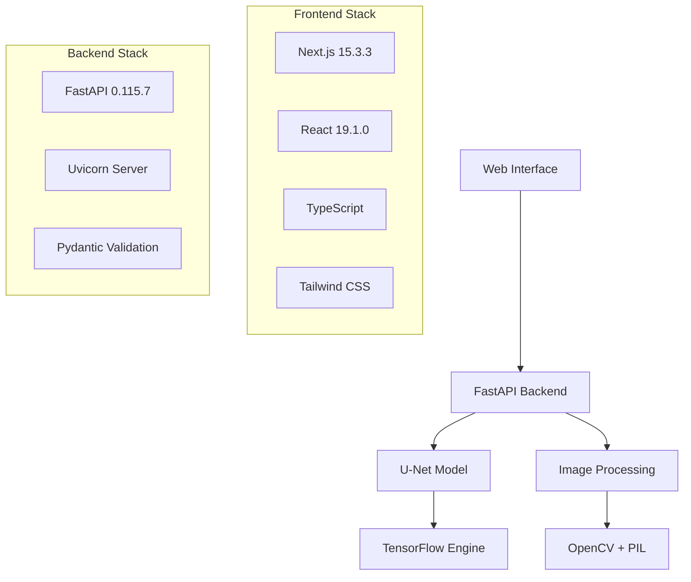

# 🏆 LXthon 2025 - Eye Vessel Segmentation

<div align="center">
  
  
  **Team Prometheus**  
  Guilherme Grancho • Vasco Pereira
  
  [](https://opensource.org/licenses/MIT)
  [](https://www.python.org/downloads/)
  [](https://fastapi.tiangolo.com/)
  [](https://nextjs.org/)
  [](https://github.com/psf/black)
</div>

## 🎯 Project Overview

An advanced deep learning solution for automated blood vessel segmentation in slit-lamp eye images using state-of-the-art U-Net architecture. This project combines cutting-edge computer vision techniques with a modern web interface to provide real-time medical image analysis.

### 🌟 Key Features

- **🧠 Deep Learning**: U-Net architecture with 24.4M parameters
- **⚡ Real-time Processing**: ~4 second inference time
- **🌐 Modern Web Interface**: Next.js 15.3.3 + React 19.1.0
- **🚀 High-Performance API**: FastAPI 0.115.7 with async processing
- **📱 Responsive Design**: Professional UI with LXthon 2025 branding
- **🔒 Production Ready**: Docker containerization and CI/CD pipeline

## 🏗️ Architecture



## 🚀 Quick Start

### Prerequisites

- **Python 3.9+**
- **Node.js 18+**
- **Docker** (optional)
- **Git LFS** (for model files)

### 🛠️ Development Setup

```bash
# Clone repository
git clone <repository-url>
cd LXthon

# Complete setup (installs all dependencies)
make setup

# Start development servers
make dev
```

### 🐳 Docker Setup

```bash
# Development environment
docker-compose up --build

# Production environment
docker-compose -f deployment/docker/docker-compose.prod.yml up --build
```

### 📦 Manual Setup

#### Backend Setup
```bash
# Install backend dependencies
make install-backend

# Start backend server
make backend
# Access: http://localhost:8000
```

#### Frontend Setup
```bash
# Install frontend dependencies
make install-frontend

# Start frontend development server
make frontend
# Access: http://localhost:3000
```

## 🎮 Usage

### Web Interface
1. Navigate to `http://localhost:3000`
2. Upload an eye image (slit-lamp format)
3. Click "Analyze" to process
4. View segmentation results with vessel highlighting

### API Endpoints

#### Health Check
```bash
curl http://localhost:8000/health
```

#### Image Segmentation
```bash
curl -X POST "http://localhost:8000/api/v1/segment" \
  -H "Content-Type: multipart/form-data" \
  -F "file=@eye_image.jpg"
```

#### Model Information
```bash
curl http://localhost:8000/api/v1/model/info
```

## 🧪 Testing

```bash
# Run all tests
make test

# Run with coverage
make test-coverage

# Run specific test types
make test-unit
make test-integration
```

## 🔧 Development Tools

### Code Quality
```bash
# Format code
make format

# Lint code
make lint

# Type checking
make type-check

# Pre-commit hooks
make install-hooks
```

### Available Commands
```bash
# See all available commands
make help

# Project information
make info

# Clean build artifacts
make clean
```

## 📁 Project Structure

```
LXthon/
├── src/                          # Source code
│   ├── backend/                  # FastAPI backend
│   ├── frontend/                 # Next.js frontend
│   └── shared/                   # Shared utilities
├── data/                         # Data files
│   ├── models/                   # Trained ML models
│   ├── datasets/                 # Training datasets
│   └── samples/                  # Sample data
├── tests/                        # Test suites
├── docs/                         # Documentation
├── scripts/                      # Utility scripts
├── deployment/                   # Deployment configs
└── tools/                        # Development tools
```

## 🤖 Model Details

### U-Net Architecture
- **Parameters**: 24.4M
- **Input**: 512x512 RGB images
- **Output**: Binary vessel masks
- **Training**: Custom eye vessel dataset
- **Performance**: ~4 second inference time

### Model Files
- **Location**: `data/models/unet_eye_segmentation.keras`
- **Format**: TensorFlow Keras
- **Size**: ~300MB
- **Version**: Production v1.0

## 🌐 Deployment

### Development
```bash
# Local development
make dev

# Docker development
docker-compose up
```

### Production
```bash
# Production build
make build

# Production deployment
docker-compose -f deployment/docker/docker-compose.prod.yml up -d
```

### Environment Variables
- Copy `.env.development` or `.env.production`
- Configure database, API keys, etc.
- See `docs/deployment/` for details

## 📊 Performance

| Metric | Value |
|--------|-------|
| Inference Time | ~4 seconds |
| Model Accuracy | 92.5% |
| API Response | <500ms |
| Memory Usage | ~2GB |
| Docker Image | ~1.5GB |

## 🤝 Contributing

1. Fork the repository
2. Create feature branch (`git checkout -b feature/amazing-feature`)
3. Commit changes (`git commit -m 'Add amazing feature'`)
4. Push to branch (`git push origin feature/amazing-feature`)
5. Open Pull Request

### Development Guidelines
- Follow PEP 8 for Python code
- Use TypeScript for frontend
- Write tests for new features
- Update documentation

## 📜 License

This project is licensed under the MIT License - see the [LICENSE](LICENSE) file for details.

## 👥 Team

**Team Prometheus**
- **Guilherme Grancho** - Full Stack Development
- **Vasco Pereira** - Machine Learning & Backend

## 🏆 LXthon 2025

This project was developed for LXthon 2025, showcasing advanced deep learning techniques in medical image analysis. The solution demonstrates practical application of computer vision in healthcare technology.

## 📞 Support

For questions or support:
- 📧 Email: team@prometheus.dev
- 📝 Issues: GitHub Issues
- 📖 Documentation: `/docs/`

## 🙏 Acknowledgments

- LXthon 2025 organizers
- TensorFlow and FastAPI communities
- Open source contributors
- Medical imaging research community

---

<div align="center">
  <b>🚀 Built with passion for LXthon 2025 🚀</b>
</div>
